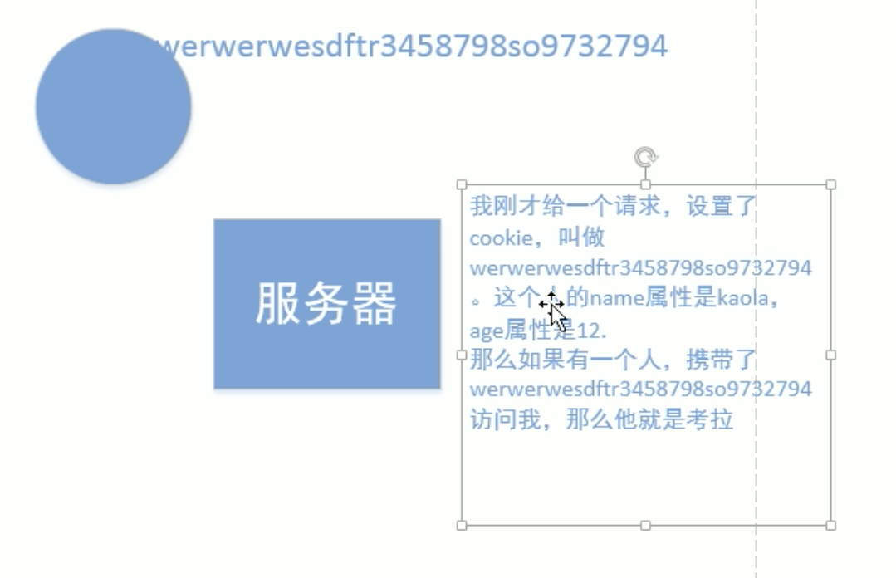

**nodejs**
===
__2018年6月4日__
---
>- express 是基于nodejs的后台框架
>>- 1 npm install express --save  (save 会修改package.json)
>>- 2 强大的路由能力 *app.use()*
>>- 3 强大的静态路由能力 *app.use(express.static(path))* 
>>- 4 与模版引擎结合的能力
>>- app.set("view engine","ejs")
>>- app.get("/",function(req,res{
>>- res.render("ejsname"{ejsdata})
>>- }))
---
>路由
>>app.get("path")当访问一个网址的时候做什么事情。 path 可以使用正则表达式
>>app.all()能处理网址的任何访问。并且参数不区分大小写。url不区分大小写？会被忽略 path：id  req.paras.id 会在参数中被得到
---
> 了解cookies 的用法熟悉cookies的参数。 对于中间件的熟悉，以及传入模块app.use(require("module"))作为中间件。以及中间件的推测实现。 了解了romens脚手架里面的用到的组件，大致看了一些组件的作用比如moment

---

# restful
- 当你用不同的http请求相同url的时候，会给出不同的反馈。

# 中间件
> 当app.get("/") 匹配上时则停止匹配，如果要执行接下来的匹配，需要显示的调用next();get post 就是中间见
>- app.use() 在匹配上时候做什么。get是精确匹配。use是前端适配。当不写路径的时候就相当于“／”

## 中间件可以理解成为中间添加一些东西。

__2018年6月5日__
跨域
---
>*我们假设bob.com站点想要访问alice.com站点的某些数据。这种类型的请求由于浏览器的同源策略通常是不被允许的。不过，如果支持CORS请求，那么alice.com站点就可以通过增加一些特定的响应头信息来接受bob.com站点的数据访问* 
---
>*res.end()参数必须是字符串*

---
>如何将nodejs 的异步变成同步
>module.export = cc , 默认构造函数
>export = func ,默认本身
>如果不指定文件夹，那么指定从 nodemodule文件夹带后缀名为文件，否则是文件夹（下的index.js文件）

__201866__
>后台的模版引擎主要有两个，ejs和 jade
fs.readfile(ejs,{a=6})
>> ejs 主要是通过绑定数据然后 ejs 绑定数据。fs 读取之后然后，注入消息。
>> jade 也是类似于前者的一个解析工具。
---
__cookies and Session__

>session 依赖cookies 但是cookies记录是乱码，然后上传之后就拿去和服务端的session（缓存）比较。所以用cookies的乱码来标示 session的key

