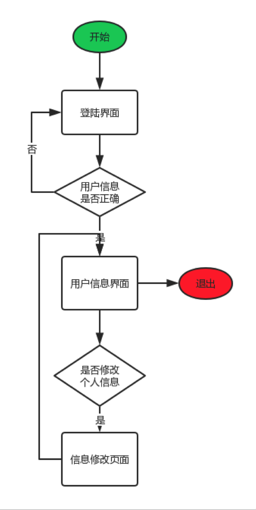
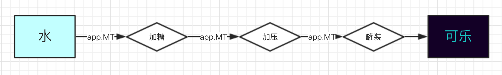
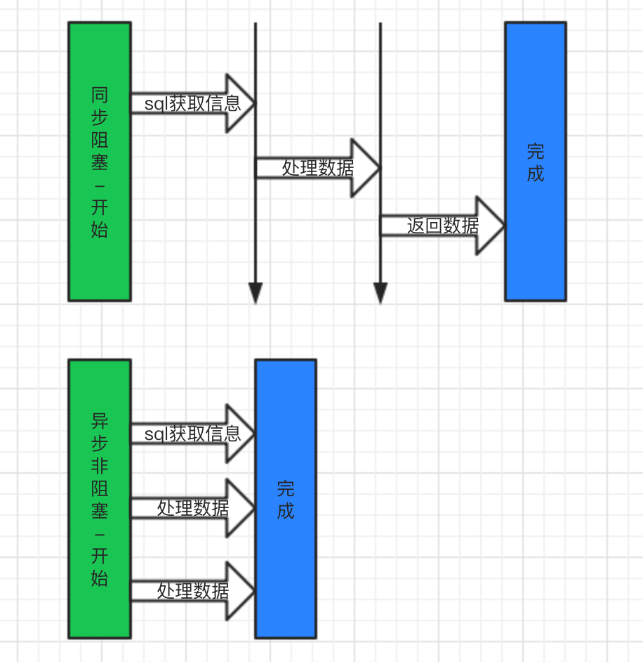

# 登陆模块设计

 

### 1.用户访问url进入登陆界面
>1. 通过这个模块，熟悉了http的访问请求，当用户访问url时候，会被端口监听捕获到。中间附带两个参数， request和response，分别是对客户端上行请求的解析，和服务端将要返回数据的解析。通过处理request中的信息，并且为response中写入对应的数据，当调用response 中end()的时候服务端会将响应体打包后发回给客户端。完成一次从请求发起到结束的全过程。

### 2.在登陆界面，用户输入用户名和密码。判断用户输入的信息是否正确，若不正确则停留在当前页面，否则跳转到
  
>1. 用户输入用户名和密码并且提交到服务器，这个过程客户端使用了 post。分析http的几种请求方式，并分析其中的异同。
>2. 使用get 主要是想从服务端获取数据，在不涉密的请求可以使用这种方式，这种请求的方式会将信息填充到请求头，然后用过可见的url发送给服务端，服务端接受并且给予响应。
>3. 使用post 字面意思是向服务端提交数据，正好适合提交密码等信息。由于post 请求的特殊性，密码等信息不会暴露在可见url中，而是存放在body中相对于get方式安全一些。其实http还有几种请求方式，但是不常用。比如delete，和put。
>4. 因为nodejs 原生写法的复杂性，为了解决痛点，express框架诞生了。主要的设计特点是中间件模式。
>### 中间件
>
>>>1. 每当水流数据从高层流入，然后进行一系列的处理，最后变成可乐的过程中。我们根据需求拦截某一步，做出相应的操作，这个操作在express里面被称为中间件。拦截的操作被称之为 __路由__
>>>2. 当中间件被设置了路径的路由捕获之后，就会中断接下来的路由传递。此时需要对这个路由做出相应操作，如果此时想要继续传递这个路由，则需要调用传入的下一个操作的handler，则此时会继续把客户端上行的Request和服务端的将返回Response、流向下一个 工作区间。
>>>3. express 可以很容易的与模版结合,比如 ejs 和 jade。
>>>4. express 拥有强大的三方中间件支持。帮助你快速完成从水到制作可乐的过程。 减少重复繁琐的操作。
>5. 数据库操作，用户键入用户名和密码，会被post到服务端，随机服务端会从数据库select对应的表，当有与之匹配的数据项时候返回数据，反之报错。(数据库异步)
>### 异步和同步
>
>>>- 异步操作，不同绝大部分的服务端框架，nodejs 自带异步。对于开发者异步不需要投入任何代码。反而在nodejs 中同步是需要学习的。npm中有很多同步第三发，避免死亡回调，尽量选择then操作的。

### 3. 进入用户信息页面，用户可以选择修改个人信息，也可以直接退出页面。若用户选择修改，则跳转到修改页面
>1. 修改用户信息，包括提交用户头像，修改用户个人信息。但是程序的入口原则是从登陆到用户信息，在不登陆的情况下，不允许直接请求非登陆路由。需要加入验证。
>### Cookie & Session
>
>>>- Cookie是 service发送给客户端的一个标记，因为纯http是无状态的，上一个会话和下一个会话没有任何关系。当服务端想要记录这种会话的时候，有两种方式
>>> 1. Cookie 是服务端发送给web浏览器的一种数据，浏览器将这个数据保存下来，然后在进行下一次访问的时候，request中会携带上这个数据。但是Cookie的数据量很小，最大只能是4096字节。可以存取数据，作为会话的纪录。
>>> 2. Session 是服务端纪录会话的一种方式，但是这种方式是的容量会大很多。同时根据我的理解，Session是依赖于Cookie的。当服务端大量存取Session的时候需要用到 客户端访问所提供的Cookie 作为读取Session的key。这样便可以方便的拿到这到底是属于那个用户的数据。以便于回到当时的会话。
>2. 使用Session,用于验证客户端的状态，以及用户属性操作。保证http会话可延续性。
>3. 用户可选择登出，当用户登出、随即清除Session随即重定向到用户登陆，一次完整的访问结束。

### 4. 进入信息修改页面，用户对个人信息进行修改，点击保存后返回到用户信息页面。
>1.  用户修改个人信息使用同步库操作mysql。修改完成mysql回调响应，地址重定向到用户信息界面。