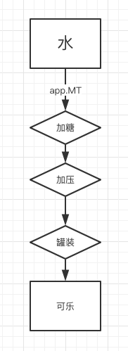
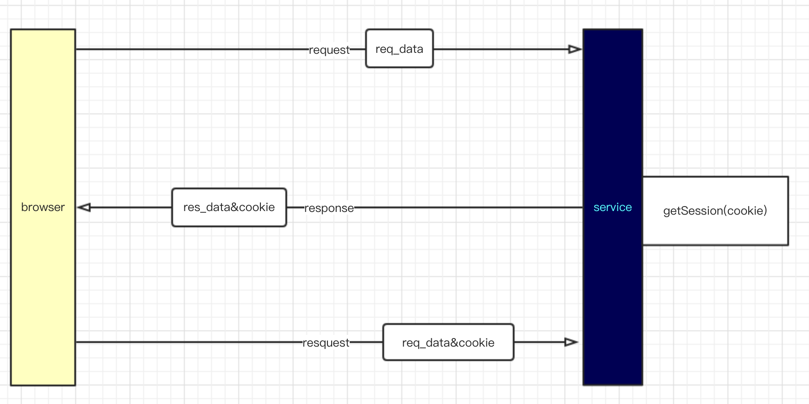

# 六月第一周
## 1. Express的理解
>>- express是nodejs 上一个以工程流方式处理请求的框架
>>
>>
---
>>1. 每当水流数据从高层流入，然后进行一系列的处理，最后变成可乐的过程中。我们根据需求拦截某一步，做出相应的操作，这个操作在express里面被称为中间件。拦截的操作被称之为 __路由__
>>2. 当中间件被设置了路径的路由捕获之后，就会中断接下来的路由传递。此时需要对这个路由做出相应操作，如果此时想要继续传递这个路由，则需要调用传入的下一个操作的handler，则此时会继续把客户端上行的Request和服务端的将返回Response、流向下一个 工作区间。
>>3. express 可以很容易的与模版结合,比如 ejs 和 jade。
>>4. express 拥有强大的三方中间件支持。帮助你快速完成从水到制作可乐的过程。 减少重复繁琐的操作。

---
## 2. Cookie && Session
>>
>>- Cookie是 service发送给客户端的一个标记，因为纯http是无状态的，上一个会话和下一个会话没有任何关系。当服务端想要记录这种会话的时候，有两种方式
>> 1. Cookie 是服务端发送给web浏览器的一种数据，浏览器将这个数据保存下来，然后在进行下一次访问的时候，request中会携带上这个数据。但是Cookie的数据量很小，最大只能是4096字节。可以存取数据，作为会话的纪录。
>> 2. Session 是服务端纪录会话的一种方式，但是这种方式是的容量会大很多。同时根据我的理解，Session是依赖于Cookie的。当服务端大量存取Session的时候需要用到 客户端访问所提供的Cookie 作为读取Session的key。这样便可以方便的拿到这到底是属于那个用户的数据。以便于回到当时的会话。

__六月四日__
>> http 协议的基本构成，Get 和 Post 方法的区别 以及在express中的使用。

__六月五日、六日__
>> 调研公司framework里面的工具类项目的构成。
>> 调研swagger的用法，以及yaml的语法。

__六月七日、八日__
>> express 对中间件的熟悉，express.router用法熟悉，静态文件路由加载。图片文件的上传，fs模块的使用。
>> 对Cookie、Session的熟悉以及在用户登陆模块中的使用。静态文件相对路径的处理。