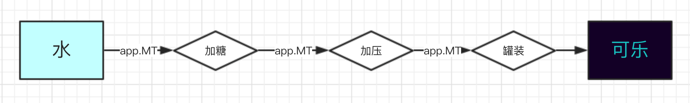

# 六月四日
## 1. Express的理解
>> nodejs 上一个以工程流方式处理请求的框架
>>
>>
---
>>- 每当水流数据从高层流入，然后进行一系列的处理，最后变成可乐的过程中。我们根据需求拦截某一步，做出相应的操作，这个操作在express里面被称为中间件。拦截的操作被称之为 __路由__
>>- 当中间件被 设置了路径的路由捕获之后，就会中断下面的路由传递。此时需要对这个路由做出相应操作，如果此时想要继续传递这个路由，则需要调用传入的 下一个操作的 handler，则此时会继续把客户端上行参数和服务端的返回继续流向下一个 工作区间。

>>- express 可以很容易的与模版结合,比如 ejs 和 jade。
>>- express 拥有强大的三方中间件支持。

---
## 2. Cookies && Session
>> cookeis service发送给客户端的一个标记，因为纯http是无状态的，上一个会话和下一个会话没有任何关系。当服务端想要记录这种会话的时候，有两种方式
>> 1. Cookie 是服务端发送给web浏览器的一种数据，浏览器将这个数据保存下来，然后在进行下一次访问的时候，request中会携带上这个数据。但是cookies的数据量很小，最大只能是4096字节。