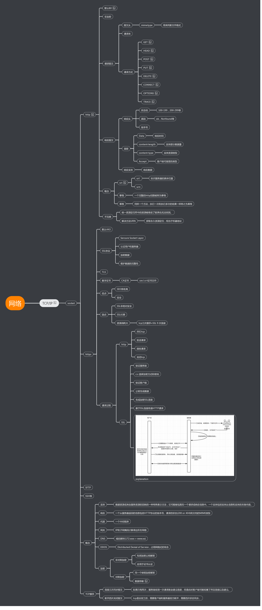
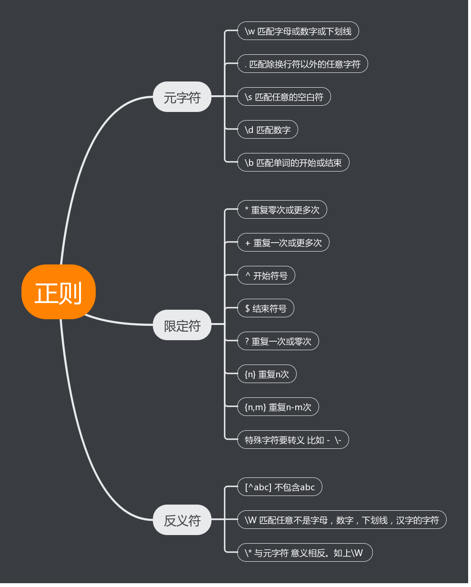

## 计算机网络 ##

1. HTTPS
>- HTTPS协议 是 HTTP协议 + SSL/TLS协议的组合，其实也就是HTTPS协议是在HTTP协议基础上加了一层SSL/TLS协议进行数据加解密。也就是说使用HTTPS协议之后在网络上传输的数据是加密的密文，即便进行拦截后没有密钥进行解密的话也就是一串乱码。里面涉及到几个关于数据加密的知识。
>- 对称密钥 - 既同一个密钥，既能用于加密数据也能用于解密数据，对称的意思就是你这头用什么加密,主要是用于数据传输，对称加密的对于CPU的开销相对不大。
>- 非对称秘钥是一个秘钥组合包含两个密钥，一个是公钥一个是私钥。其中公钥只能用于加密，私钥只能用于解密,因此加解密双方不需要使用同一个密钥，数据加密方只需要私钥进行加密，数据解密方要公钥进行解密，加解密方式不同。非对称加密的使用场景主要用于证书认证，和身份验证。在服务端向证书颁发机构请求证书时，证书办法机构会将服务端提供的信息使用私钥加密，然后发送给请求的服务端，之后被服务端保存起来，在客户端要求验证的时候发送给客户端。客户端收到之后使用内置的公钥解密之后，会拿到服务端的相应信息。验证域名信息之后就可以保证对应的服务器信息了。通过解密公钥，然后产生会话密钥，通过公钥加密，发送给服务端，服务端私钥解密之后，两边拿到了相同的会话密钥，随即开始发送数据。
>- 如图：
> 
---
2. Radis
> Redis跟内存不同的是，储存在Redis中的数据是持久化的，断电或重启后，数据也不会丢失。因为Redis的存储分为内存存储、磁盘存储和log文件三部分，重启后，Redis可以从磁盘重新将数据加载到内存中，这些可以通过配置文件对其进行配置，正因为这样，Redis才能实现持久化。所以在服务器中常用来存储一些需要频繁调取的数据，这样可以大大节省系统直接读取磁盘来获得数据的I/O开销，更重要的是可以极大提升速度，通常情况下我们将radis作为关系型数据库的缓存。
---
3. 正则表达式
>- 正则表达式是用于匹配字符串中字符组合的模式,用于字符串匹配和字符串校验。可以使用正则表达式进行逻辑函数的验证。
>- 匹配：一个正则匹配一个字符串，其实指的是这个正则表达式能在字符串中找到匹配的文本
>- 元字符：一个字符是否属于元字符取决于具体的实际情况，比如.表示匹配所有的字符，但是.就表示匹配.本身
>- 流派：不同的元字符在不同的流派中是有差别的，需要具体情况具体对待
>- 子表达式：一般指的是正则的一部分，例如括号内的表达式或用|分隔开的分支
> 

4. 同步和异步
> 同步和异步是代码执行的两个方式，也就是任务执行的两种方式，同时执行单个任务，当前的任务执行完之后再执行下一个任务，此时的执行方式是同步。但是如果当前任务执行的时候想要另一个任务同时执行，以达到节约时间的目的，多个任务同时执行的方式被称为异步。
> 1. 串行，串行是同步的实现方式，同步的实现就是任务的串行。
> 2. 并行，并行是真正的异步，当任务需要多异步执行的时候，调度器会开启多个线程来执行相应的任务，当任务执行完之后，关闭线程。
> 3. 并发，并发是用单线程模拟出的异步，当多任务需要相应的时候，cpu调度机制会允许时间片轮转的方式来执行多任务，当调度合理，使用者意识不到当前机器的阻塞，而使用单线程模拟出了异步操作。但是并发并不是真正的异步，并行才是真正的异步。