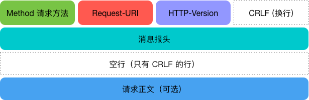
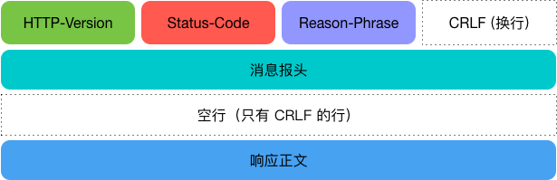

### 第三周总结。
1. 知识点
>> 计算机网络:
>>- 计算机网络OSI模型有七层，分别是应用层，表示层，会话层，传输层，网络层，数据链路层，物理层。
>>- HTTP 协议属于七层中的应用层，是属于应用层中的一个协议，还有FTP等协议，但应用场景不同。
>>- socket 网络编程接口，网络编程中使用到的。提供了关于传输层的相关网络接口。
>>- 虽然HTTP是无状态的，但是实际上HTTP是使用的TCP，遵循TCP三次握手四次挥手的基本原理。这是一个误区，因为包括我在内理解HTTP是无状态的，HTTP协议必然是用UDP实现的，其实不然。为了保证数据请求的可靠性，HTTP必然是基于tcp实现的。udp主要是用于不保证传输结果的数据传输。类似视屏直播，和游戏服务器的位置校验，对大数据量并且精度要求不高的使用场景的时候，尽量使用udp协议，udp的虽然是无连接，但是丢包率并不高，只是相对tcp传输协议丢包率稍高。
>>- TCP:Telnet、FTP、SMTP等 UDP:NFS(网络文件系统)、SNMP(简单网络管理协议)、DNS(主域名称系统)、TFTP(通用文件传输协议)等
>>- HTTP在发送请求时，如果请求的地址写的是域名，则先访问DNS服务器获取目标服务器的IP地址，然后生成HTTP请求报文，发送给TCP层,按照TCP/IP通信传输流传输给目标服务器。
>>- 客户端发送一个HTTP请求到服务器的请求消息包括：请求行（request line）、请求头部（header）、空行和请求数据四个部分组成.
>>>- 
>>- HTTP响应也由四个部分组成，分别是：状态行、消息报头、空行和响应正文
>>>- 
>>-  HTTP 主要用到的方法有两个GET，POST	GET从服务器获取指定（请求地址）的资源的信息，它通常只用于读取数据，就像数据库查询一样，不会对资源进行修改。POST 向指定资源提交数据（比如提交表单，上传文件），请求服务器进行处理。数据被包含在请求正文中，这个请求可能会创建新的资源或更新现有的资源。GET文件不带有body，所有请求信息，地址栏可见，可被捕获，POST的信息体大部分放在body中，可被工具捕获，相对GET方式安全。
---
>- mysql数据库
>>- 数据库操作语言分为 data manipulation language,data definition language,data control language,数据定义语言DDL用来创建数据库中的各种对象、表、视图、索引、同义词、聚簇等,DML用来实现数据的增删查改等信息，数据控制语言DCL用来授予或回收访问数据库的某种特权，并控制数据库操纵事务发生的时间及效果，对数据库实行监视等
>>- 
---
2. 问题
>- resave : 是指每次请求都重新设置session cookie，假设你的cookie是10分钟过期，每次请求都会再设置10分钟 (时间到和每次访问重置时间)（用户输入密码）
>- saveUninitialized: 是指无论有没有session cookie，每次请求都设置个session cookie ，默认给个标示为 connect.sid (指定之前的sessionid失效)
>- blue bird 使用时 promise 同步方法。当promisify参数为某个模块时候，会将模块中的方法promise化，变成promise对象。但是当模块中的方法没有使用异步的时候，也就不存在回调nodecallback，promise无法捕获标准回调函数，导致then无法执行，但是函数体里面的函数还是会继续执行。
---
3. 计划，
>> 学习关于软件测试，深入学习计算机网络http协议以及socket网络编程，mysql数据库知识等。